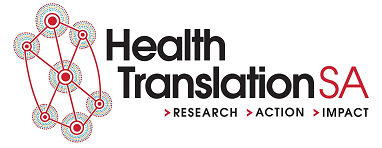

A Community of Practice for Data Professionals: Brief 1
================

-   [What do we need?](#what-do-we-need)
-   [Background](#background)
-   [Avenues and what already exists](#avenues-and-what-already-exists)
    -   [Colloquia](#colloquia)
    -   [Expert reading group](#expert-reading-group)
    -   [Non-work data hack](#non-work-data-hack)
    -   [Access to resources and tools](#access-to-resources-and-tools)
    -   [Formal training](#formal-training)
    -   [Secondments](#secondments)
-   [Common elements](#common-elements)
    -   [The right people](#the-right-people)
    -   [Events need to be regular](#events-need-to-be-regular)
    -   [Managers need to help](#managers-need-to-help)
    -   [Work needs to be valued](#work-needs-to-be-valued)
    -   [Code of conduct](#code-of-conduct)
-   [Next steps](#next-steps)

What do we need?
================

What we need are systems that promote the continuous development of data skills by data professionals and the continuous promotion of these skills throughout the health system and the broader health analytics profession. This amounts to creating a culture that values data skills and expertise. This paper details the structures that are currently in place and opportunities for layering additional structures that will foster this goal.

Background
==========

The health system in South Australia employs some particularly high performing data professionals. However, data skills are a fast changing set of competencies. Hence, for the system to receive a continued benefit from the work of these professionals, it must invest in their continuous development. In addition, making these professionals and their skills more visible across the health system will set a benchmark for other data professionals who may find that their methods have become outdated and to gain the attention of executives who may be unaware that this expertise exists within the system

It would also aid the data capability of the South Australian health system to connect the expertise within the government sector with the wealth of relevant expertise in academia and industry locally, nationally and internationally. It would help the health system improve itself to learn from these external experts and it would help the profile of the health system for its successes to be known more broadly.

There are a number of avenues available for meeting these goals. There already exists a range of regular events in Adelaide, around Australia and internationally that could serve as models to draw from or as opportunities to engage with.

Avenues and what already exists
===============================

Colloquia
---------

A sharing of completed work that focuses on the technical components in which informed peers could be invited to ask difficult and pertinent questions.

In this space already:

-   The Adelaide University Faculty of Engineering, Computer and Mathematical Sciences hosts regular [colloquia.](https://ecms.adelaide.edu.au/events/list/2020/all)

-   R Users Adelaide annual [meet-up](https://www.meetup.com/en-AU/Adelaide-R-Users/).

-   The CEIH and SAAS have hosted a data visualisation [expo](https://www.eventbrite.com.au/e/data-visualisation-expo-tickets-104931753700).

-   CALHN runs a monthly CoP that frequently invites internal presentations coordinated by Andrew McAlindon.

-   The [HPC](https://www.hpcsa.com.au/) coordinates the DAGS group that meet monthly and invites internal and external presentations coordinated by Jane Austin.

Expert reading group
--------------------

A reading of a serious text on an aspect of data analysis, software design, change management or ethics then an informed discussion about the applicability of the author’s work to our organisation.

In this space already:

-   Owen Churches convenes a monthly bookclub on [AI ethics](https://github.com/ofchurches/AI_ethics_bookclub/wiki).
-   The [NHS](https://nhsrcommunity.com/blog/nhs-r-book-club/) runs a bookclub.

Non-work data hack
------------------

Testing and developing analysis skills individually or as a group on public data sets that promote the quick exploration of public sharing or outcomes.

In this space already:

-   Owen Churches coordinates the [PublicSectR](http://publicsectradelaide.rbind.io/) monthly meetup which includes a sprint through that week’s TidyTuesday dataset.

Access to resources and tools
-----------------------------

Access to the latest journal articles to learn from and to modern software design tools.

Formal training
---------------

To some extent, formal training is helpful. In this space already:

-   The CEIH paid for a large number of data professionals in the the South Australia health system to undergo the [CHIA](https://www.healthinformaticscertification.com/) exam.

-   There are numerous paid and free data skills courses available (eg. [Coursera](https://www.coursera.org/specializations/data-science-foundations-r)).

Secondments
-----------

Hosting experts from industry and academia within the government system for a period of time and sending government employees to work in industry and academia on the condition of their return would help foster relationships and build skills.

To be effective in reaching the system goals, each of these avenues would need to be supported with some common elements.

Common elements
===============

The right people
----------------

Many of the people who could most benefit from these avenues may not readily realise the benefit to them as individuals that would come from their participation. It may help to fold these events into professional development.

Events need to be regular
-------------------------

The particular periodicity of different avenues could be negotiated but they would all need to be regular to make their participation a habit rather than a choice.

Managers need to help
---------------------

Participation would also have to be supported by managers who would have to ensure time was quarantined for participation in these activities and who led by example in attending every event.

Work needs to be valued
-----------------------

The involvement of everyone in these avenues would have to occur in paid work time. It also means that there would have to be a perception that being part of these activities would realistically lead to better individual outcomes such as promotion.

Code of conduct
---------------

It is imperative for communities of practice such as these to have well defined and agreed to codes of conduct. Tina Hardin in the CEIH has begun work on a CoC for this purpose.

Next steps
==========

1.  The value recognised Relevant stakeholders need to recognise the value of a shared CoP and to commit funds and the time of their staff to these avenues.
2.  Avenues selected Some or all of the above avenues need to be selected.
3.  Coordination established By their definition, CoPs are not imposed by a hierarchy. They are self starting and self sustaining. This necessarily involved some members investing more time than others and does not remove the need for clear governance frameworks. One or more current data professionals will need to take on the coordination of the CoPs and have this workload recognised by their employer.
