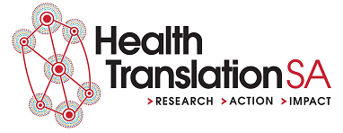
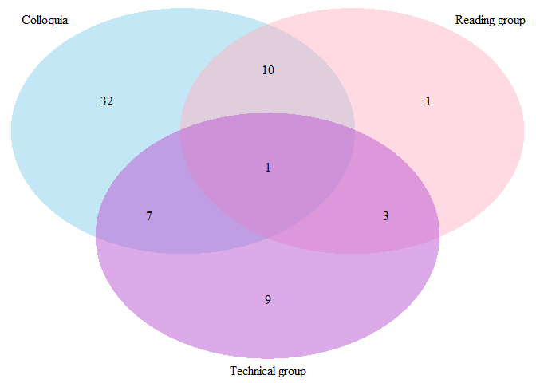

A Community of Practice for Data Professionals: Brief 2
================

-   [What do we need?](#what-do-we-need)
-   [Background](#background)
-   [Avenues and what already exists](#avenues-and-what-already-exists)
    -   [Colloquia](#colloquia)
    -   [Expert reading group](#expert-reading-group)
    -   [Technical skills practice](#technical-skills-practice)
    -   [Access to resources and tools](#access-to-resources-and-tools)
    -   [Formal training](#formal-training)
    -   [Secondments](#secondments)
    -   [Hiring practices](#hiring-practices)
-   [Common elements](#common-elements)
    -   [Overlap](#overlap)
    -   [Return on investmement](#return-on-investmement)
    -   [The right people](#the-right-people)
    -   [Managers need to help](#managers-need-to-help)
    -   [Work needs to be valued](#work-needs-to-be-valued)
    -   [Code of conduct](#code-of-conduct)
-   [Next steps](#next-steps)

What do we need?
================

What we need are systems that promote the continuous development of data skills by data professionals and the continuous promotion of these skills throughout the health system and the broader health analytic profession. This amounts to creating a culture that values data skills and expertise. This paper details the structures that are currently in place and opportunities for layering additional structures that will foster this goal.

Background
==========

The health system in South Australia employs some particularly high performing data professionals. However, data skills are a fast changing set of competencies. Hence, for the system to receive a continued benefit from the work of these professionals, it must invest in their continuous development. In addition, making these professionals and their skills more visible across the health system will set a benchmark for other data professionals who may find that their methods have become outdated and to gain the attention of executives who may be unaware that this expertise exists within the system

It would also aid the data capability of the South Australian health system to connect the expertise within the government sector with the wealth of relevant expertise in academia and industry locally, nationally and internationally. It would help the health system improve itself to learn from these external experts and it would help the profile of the health system for its successes to be known more broadly.

There are a number of avenues available for meeting these goals. There already exists a range of regular events in Adelaide, around Australia and internationally that could serve as models to draw from or as opportunities to engage with.

Avenues and what already exists
===============================

Colloquia
---------

A sharing of completed work that focuses on the technical components in which informed peers could be invited to ask difficult and pertinent questions.

In this space already:

-   The Adelaide University Faculty of Engineering, Computer and Mathematical Sciences hosts regular [colloquia.](https://ecms.adelaide.edu.au/events/list/2020/all)

-   R Users Adelaide annual [meet-up](https://www.meetup.com/en-AU/Adelaide-R-Users/).

-   The CEIH and SAAS have hosted a data visualisation [expo](https://www.eventbrite.com.au/e/data-visualisation-expo-tickets-104931753700).

-   CALHN runs a monthly CoP that frequently invites internal presentations coordinated by Andrew McAlindon.

-   The [HPC](https://www.hpcsa.com.au/) coordinates the DAGS group that meet monthly and invites internal and external presentations coordinated by Jane Austin.

### Specifics

#### Venue

A suitable venue has the following characteristics:

-   Central location to lower the friction associated with attending.

-   No usage cost would be preferred.

-   A degree of grandeur and solemnity would add gravitas to the event.

One venue that would fulfill these characteristics is the Minister's Board Room at Hindmarsh Square.

#### Frequency

Too often and it would feel like a burden but too rare and it would be forgotten. To this end, every second week or every month would be preferred.

#### Cost

To some extent it would be desirable for the even to stand on it merits as a place to hear and debate the latest ideas in health bioinformatics rather than a place to nibble food and drinks. Hence, the event could prosper with a smaller budget.

#### Invitation list

Lukah Dykes and Owen Churches have begun drafting a list of potential speakers and people to invite. This will be updated here.

Expert reading group
--------------------

A reading of a serious text on an aspect of data analysis, software design, change management or ethics then an informed discussion about the applicability of the author’s work to our organisation.

In this space already:

-   Owen Churches convenes a monthly book club on [AI ethics](https://github.com/ofchurches/AI_ethics_bookclub/wiki).
-   The [NHS](https://nhsrcommunity.com/blog/nhs-r-book-club/) runs a book club.

### Specifics

#### Venue

Both the NHS group and the AIEthics group meet online and this works particularly well. It would help to use a wiki style collaboration medium for adding additional resources and a threaded communication platform such as Slack to maintain communication between meetings.

#### Texts

What we read would be a reflection of the aims and the capacity of the group. Professor Mark Mackay has suggested that this be a vehicle to immerse people who are not currently experts in a more quantitative way of thinking. This would be in keeping with the NHM book club. Hence, books that could be read could include:

<table style="width:93%;">
<colgroup>
<col width="55%" />
<col width="37%" />
</colgroup>
<thead>
<tr class="header">
<th>Book</th>
<th>Author</th>
</tr>
</thead>
<tbody>
<tr class="odd">
<td>Calling Bullshit: The Art of Skepticism in a Data-Driven World</td>
<td>Carl T. Bergstrom Jevin D. West</td>
</tr>
<tr class="even">
<td>How To Make The World Add Up</td>
<td>Tim Hartford</td>
</tr>
<tr class="odd">
<td>The Ostrich Paradox Why We Underprepare for Disasters</td>
<td>Robert Meyer and Howard Kunreuther</td>
</tr>
<tr class="even">
<td>The Art of Statistics: Learning from Data</td>
<td>David Spiegelhalter</td>
</tr>
<tr class="odd">
<td>The Art of Logic in an Illogical World</td>
<td>Eugenia Cheng</td>
</tr>
<tr class="even">
<td>Merchants of Doubt: How a Handful of Scientists Obscured the Truth on Issues from Tobacco Smoke to Global Warming</td>
<td>Naomi Oreskes, Erik M. Conway</td>
</tr>
<tr class="odd">
<td>The Signal And The Noise: The Art And Science Of Prediction</td>
<td>Nate Silver</td>
</tr>
<tr class="even">
<td>Standards: Recipes for Reality</td>
<td>Lawrence Busch</td>
</tr>
<tr class="odd">
<td>The Sum of the People: How the Census Has Shaped Nations, from the Ancient World to the Modern Age</td>
<td>Andrew Whitby</td>
</tr>
<tr class="even">
<td>The Design Thinking Playbook: Mindful Digital Transformation of Teams, Products, Services, Businesses and Ecosystems</td>
<td>Michael Lewrick</td>
</tr>
</tbody>
</table>

#### Cost

This is strongly determined by the number of people in the group. But with a budget of 50 dollars per book and a group of 10 readers this would cost 500 dollars.

Technical skills practice
-------------------------

Testing and developing analytical and programming skills individually or as a group on public data sets that promote the quick exploration of public sharing or outcomes.

In this space already:

-   Owen Churches coordinates the [PublicSectR](http://publicsectradelaide.rbind.io/) monthly meetup which includes a sprint through that week’s TidyTuesday dataset.
-   Adelaide University's statistics specialisation runs a GentleR group each week for people to bring in their R related problems.
-   The [CAIN](https://www.cain.science/) at UniSA runs a weekly R group focused around reading the [R4DS](https://r4ds.had.co.nz/) book.

### Specifics

#### Venue

There are pros and cons to meeting online and in person. Online meetings reduce the friction of attending but in person meetings promote a stronger group identity and commitment to the process. To start with, the suggestion is that we meet in person at SAHMRI. If more people want to take part at different venues then we could have multiple locations.

#### Technology

It would be fitting if the technology we used to work on this was itself a learning opportunity for those taking part and an example to others of what we can achieve. Hence the proposal is that we maintain a portfolio of our work in a [blogdown](https://bookdown.org/yihui/blogdown/) site with an associated GitHub repository.

#### Focus

Two potential sub-avenues exist:

-   A methodological learning together group that could move sequentially through:

1.  [R4DS](https://r4ds.had.co.nz/)
2.  [Advanced R](https://adv-r.hadley.nz/)
3.  [Mastering SHiny](https://mastering-shiny.org/)
4.  [Hands-On Machine Learning with R](https://bradleyboehmke.github.io/HOML/)

-   Greer Humphrey and Owen Churches have begun work on a mini-hackathon where a group designs together and creates a visulaisation and analytic product based on a novel data set.

#### Frequency

This group would benefit from meeting weekly.

Access to resources and tools
-----------------------------

Access to the latest journal articles to learn from and to use modern software design tools.

Formal training
---------------

To some extent, formal training is helpful. In this space already:

-   The CEIH paid for a large number of data professionals in the the South Australia health system to undergo the [CHIA](https://www.healthinformaticscertification.com/) exam.

-   There are numerous paid and free data skills courses available (eg. [Coursera](https://www.coursera.org/specializations/data-science-foundations-r)).

### Specifics

This will be perceived by some as an indulgence or a boondoggle for some to avoid doing work. However, structures should be put in place to make a clear return on investment for the health system in South Australia. These could include:

-   If the exams are not taken the learner could be asked to return the money.

-   The choice of training could be decided by managers with experience of each learners skill base and the needs of the health system.

Secondments
-----------

Hosting experts from industry and academia within the government system for a period of time and sending government employees to work in industry and academia on the condition of their return would help foster relationships and build skills.

### Specifics

This would require strong structures to ensure that measurable outcomes were attained. These could include:

-   A process for disseminating the results of the project at its conclusion.
-   A competitive entry program based on merit of person and project

Hiring practices
----------------

Within the contemporary software and data analytics industry it is common to recruit through the based on an applicant's engagement in the [open source programming community](https://www.socialtalent.com/blog/recruitment/source-amazing-developers-nobody-else-can-find) including their GitHub profile or history of stack overflow answers. Following the recruitment stage it is also common to have a selection process that includes a [code intervew](https://www.tutorialspoint.com/r/r_interview_questions.htm). The health system in South Australia could provide similar practices.

To be effective in reaching the system goals, each of these avenues would need to be supported with some common elements.

Common elements
===============

Overlap
-------

Idealy, the different avenues described above will feed each other and expand the total pool of people engaged rather than canabilising the same pool. In particular, the first three avenues which all entail regular events could overlap in the following manner:

Return on investmement
----------------------

The avenues above include notes on their cost but this should be viewed in the context of the returns they will provide to the health system in South Australia from savings and increased productivity. Potential savings include the budget that is currently spent on consultants for data related products and services. Some procurmement that could be avoided by having staff capable of achieving these ends include:

<table>
<colgroup>
<col width="17%" />
<col width="20%" />
<col width="17%" />
<col width="20%" />
<col width="24%" />
</colgroup>
<thead>
<tr class="header">
<th>Reference</th>
<th>Contract Title</th>
<th>Start Date</th>
<th>Expiry Date</th>
<th>Total Cost</th>
</tr>
</thead>
<tbody>
<tr class="odd">
<td>SAH760</td>
<td>Data refresh of My Home Hospital Business Case - Contract ID SAH2020-1198</td>
<td>03/08/2020</td>
<td>07/09/2020</td>
<td>$ 31,720.00</td>
</tr>
<tr class="even">
<td>SAH701</td>
<td>SAHMRI Consultant Engagement - Health and Aged Care Interface Data Project Contract ID SAH2020-533</td>
<td>08/05/2020</td>
<td>23/10/2020</td>
<td>$ 87,625.00</td>
</tr>
<tr class="odd">
<td>SAH746</td>
<td>Think Research's Visit to Central Adelaide LHN</td>
<td>02/12/2019</td>
<td>02/01/2020</td>
<td>$ 60,000.00</td>
</tr>
<tr class="even">
<td>SAH680</td>
<td>Evaluating the health transform, inspire, engage and redesign leadership and management training program</td>
<td>01/05/2019</td>
<td>31/12/2020</td>
<td>$ 56,184.00</td>
</tr>
<tr class="odd">
<td>DH042264</td>
<td>Data collection services for population health surveillance surveys Contract ID SAH2017-1069</td>
<td>01/05/2018</td>
<td>30/04/2022</td>
<td>$ 3,404,573.00</td>
</tr>
<tr class="even">
<td>DH040717</td>
<td>Health Activity Modelling and Forecasting Services Contract ID SAH2016-2026</td>
<td>20/02/2018</td>
<td>19/02/2022</td>
<td>$ 686,400.00</td>
</tr>
<tr class="odd">
<td>DH026484</td>
<td>Data Management System. Contract ID: SAH2014-983</td>
<td>01/04/2015</td>
<td>30/03/2022</td>
<td>$ 774,213.00</td>
</tr>
</tbody>
</table>

The right people
----------------

Many of the people who could most benefit from these avenues may not readily realise the benefit to them as individuals that would come from their participation. It may help to fold these events into professional development.

Managers need to help
---------------------

Participation would also have to be supported by managers who would have to ensure time was quarantined for participation in these activities and who led by example in attending every event.

Work needs to be valued
-----------------------

The involvement of everyone in these avenues would have to occur in paid work time. It also means that there would have to be a perception that being part of these activities would realistically lead to better individual outcomes such as promotion.

From all of this, one feature that could (and should) become valued is employees [contributing to open source](https://opensource.com/business/13/2/why-company-contribute-open-source) technology. The benefits to the organisation of having employees contribute to open source technology include:

-   Additional on the job training for staff.

-   Feedback on the work of our staff from the best technology developers inthe world.

-   Employees pushed to create better technology.

-   Credibility of the South Austraian health system as a serious leader in health analytics.

To these ends, staff should be rewarded for developing or contributing to technology that others can use. Some of this technology, such as corporate [ggplot themes](https://rpubs.com/mclaire19/ggplot2-custom-themes) would be for others within the SA Health system to use. Others, such as new ways of [plotting network diagrams](https://github.com/thomasp85/tidygraph/issues/128) would be of benefit to others outside the imediate system.

Code of conduct
---------------

It is imperative for communities of practice such as these to have well defined and agreed to codes of conduct. Tina Hardin in the CEIH has begun work on a CoC for this purpose.

Next steps
==========

1.  The value recognised Relevant stakeholders need to recognise the value of a shared CoP and to commit funds and the time of their staff to these avenues.
2.  Avenues selected Some or all of the above avenues need to be selected.
3.  Coordination established By their definition, CoPs are not imposed by a hierarchy. They are self starting and self sustaining. This necessarily involved some members investing more time than others and does not remove the need for clear governance frameworks. One or more current data professionals will need to take on the coordination of the CoPs and have this workload recognised by their employer.
