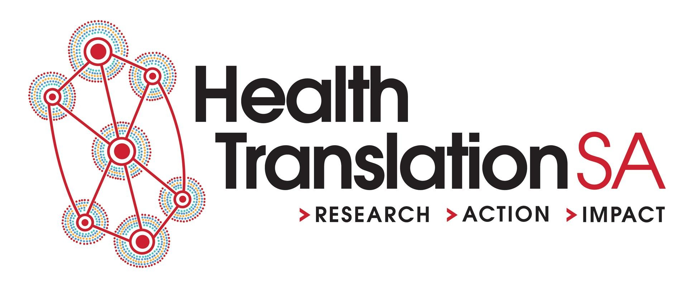

A Community of Practice for Data Professionals: To do list
================

-   [February 2021](#february-2021)
-   [April 2021](#april-2021)
-   [July 2021](#july-2021)
-   [February 2022](#february-2022)

# February 2021

## TidyTuesday

1.  Soft trial with Greer 19 January
2.  Establish home on webiste for event information
3.  Establish home on webiste for archive of output
4.  Snowball recruit

## Seminars

1.  Find physical home
2.  Set up online presentation home
3.  Set up archive on website for slides
4.  Set up webiste event information

## Online building

1.  Set up Slack

# April 2021

## Online building

1.  Add other groups to webiste including DAGS, AIEthics, RUsers
2.  Exemplar project gallery
3.  More logos

# July 2021

## Consult with HR

1.  Promotion
2.  Recruitment
3.  Secondments
4.  Degree progression

## Consult with IT

1.  Admin rights
2.  Install R
3.  Open source

## Consult with Adelaide University

1.  Degree progression

## Data visuatisation showcase

1.  Make annual
2.  Host online
3.  Archive

## Online building

1.  Register of expertise
2.  Technical tools blog (RMarkdown for reports, reveal.js for slides, GitHub for collaboration)
3.  Wiki of solutions to common problems

# February 2022

## Weekly blookclubs with bookdown archives

1.  R
2.  Statistics
3.  Visulaisation
4.  History
5.  Management

## New positions created

1.  Executive director data capability
2.  Data and culture lead
